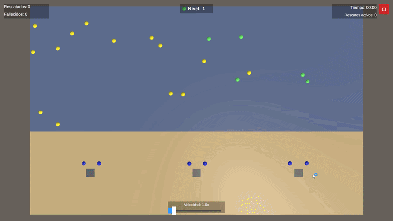
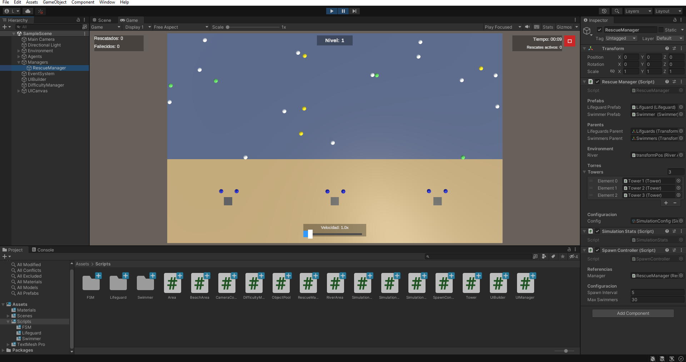
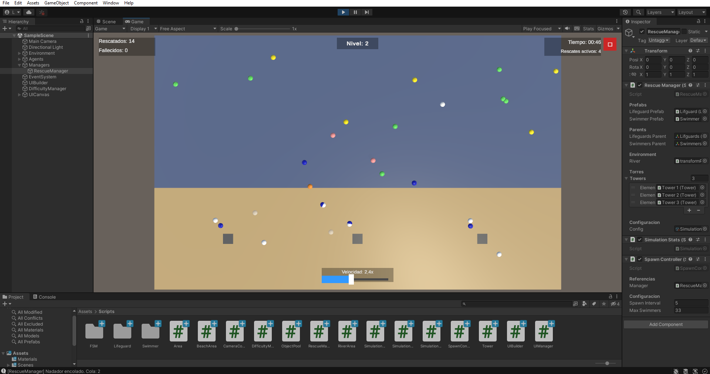
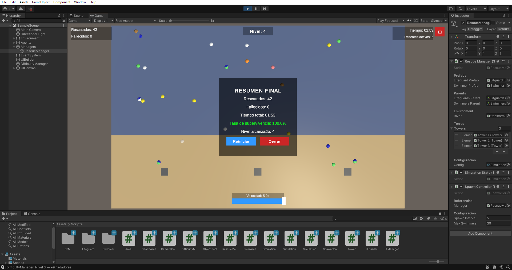
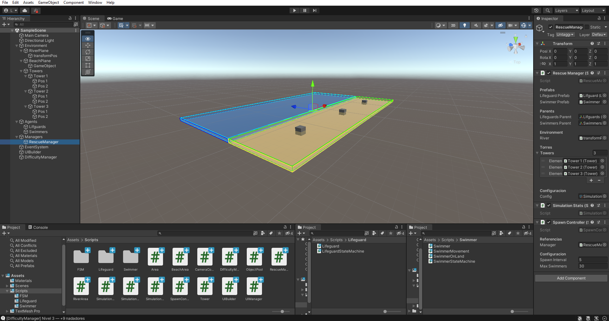

# 🏊 Guardavidas — Simulación de Rescate Acuático

> Simulación autónoma desarrollada en **Unity 2021** con **C#**, orientada a demostrar arquitectura de software, patrones de diseño y buenas prácticas de desarrollo en videojuegos.



---

## 📋 Descripción

Una playa con nadadores que se agotan, se ahogan y necesitan ser rescatados. Guardavidas autónomos patrullan desde sus torres, detectan emergencias y ejecutan rescates en tiempo real.

La simulación corre indefinidamente: los nadadores reaparecen, los guardavidas vuelven a sus torres y el ciclo continúa. La dificultad aumenta progresivamente con el tiempo.

---

## 🎮 Controles

| Acción | Control |
|---|---|
| Paneo de cámara | Click derecho + arrastrar |
| Zoom | Scroll del mouse |
| Velocidad de simulación | Slider en pantalla (0.5x — 5x) |
| Cerrar | Botón ✕ en pantalla |

---

## 🏗️ Arquitectura

El proyecto está diseñado con una arquitectura en capas donde cada sistema tiene una responsabilidad única y clara.

```
├── Core
│   ├── FSM.cs                  — Máquina de estados genérica
│   ├── SimulationConfig.cs     — ScriptableObject de configuración
│   └── SimulationEvents.cs     — Bus de eventos (patrón Observer)
│
├── Agents
│   ├── Swimmer.cs              — Entidad nadador
│   ├── SwimmerStateMachine.cs  — Estados del nadador
│   ├── SwimmerMovement.cs      — Movimiento en el agua
│   ├── SwimmerOnLand.cs        — Comportamiento post-rescate
│   ├── Lifeguard.cs            — Entidad guardavidas
│   └── LifeguardStateMachine.cs— Estados del guardavidas
│
├── Environment
│   ├── Area.cs                 — Clase base de zonas
│   ├── RiverArea.cs            — Zona del río
│   ├── BeachArea.cs            — Zona de la playa
│   └── Tower.cs                — Torre de vigilancia
│
└── Systems
    ├── RescueManager.cs        — Coordinador central + cola de rescates
    ├── SpawnController.cs      — Control de reaparición
    ├── DifficultyManager.cs    — Dificultad progresiva
    ├── SimulationStats.cs      — Estadísticas en tiempo real
    ├── ObjectPool.cs           — Pool genérico de objetos
    └── UIBuilder.cs            — Construcción de UI por código
```

---

## 🔄 Flujo de la simulación

```
RescueManager
  └── Spawna nadadores (Niño / Adulto / Atleta) y guardavidas

Swimmer (Swimming)
  └── Se agota gradualmente
      └── Swimmer (Exhausted) — visual amarillo
          └── Swimmer (Drowning) — visual rojo parpadeante
              └── RescueManager.RequestRescue()
                  ├── Guardavidas libre disponible
                  │   └── Lifeguard (GoingToRescue)
                  │       └── Lifeguard (BringingBack)
                  │           └── Swimmer (Resting)
                  │               └── SwimmerOnLand → fade out → pool
                  └── Sin guardavidas libre
                      └── Cola priorizada por urgencia
                          └── Se asigna cuando hay guardavidas disponible

DifficultyManager
  └── Cada 30s sube el nivel → más nadadores + energía se pierde más rápido
```

---

## 🧩 Patrones de diseño aplicados

### State — Máquina de estados finitos (FSM)
Cada agente tiene su propia FSM construida sobre una clase genérica reutilizable. Los estados son clases independientes con `OnEnter`, `OnUpdate` y `OnExit`.

**Estados del nadador:** `Swimming → Exhausted → Drowning → BeingRescued → Resting`

**Estados del guardavidas:** `Idle → GoingToRescue → BringingBack → Returning`

```csharp
// FSM genérica — cualquier agente puede usarla
fsm.CreateState("Drowning", new DrowningState(swimmer, config.drowningTime));
fsm.ChangeState("Drowning");
```

---

### Observer — Bus de eventos desacoplado
`SimulationEvents` es un bus estático que permite que cualquier sistema reaccione a eventos sin conocer al emisor. `SimulationStats` y `UIBuilder` se suscriben sin que `Swimmer` o `Lifeguard` los conozcan.

```csharp
// Emisor (Swimmer) — no sabe quién escucha
SimulationEvents.SwimmerDrowning(this);

// Receptor (SimulationStats) — no sabe quién emite
SimulationEvents.OnSwimmerDrowning += HandleDrowning;
```

---

### Object Pool
En lugar de `Instantiate/Destroy` en runtime, los nadadores se obtienen y devuelven a un pool genérico, reduciendo el garbage collector y mejorando la performance.

```csharp
// Obtener del pool en lugar de Instantiate
Swimmer sw = swimmerPool.Get(pos, Quaternion.identity);

// Devolver al pool en lugar de Destroy
swimmerPool.Return(swimmer);
```

---

### ScriptableObject — Configuración centralizada
Todos los parámetros de la simulación viven en un asset `SimulationConfig`. No hay valores hardcodeados en los scripts. Permite crear múltiples configuraciones sin tocar código.

```csharp
[CreateAssetMenu(menuName = "Simulation/Config")]
public class SimulationConfig : ScriptableObject
{
    public int   swimmerCount   = 20;
    public float drowningTime   = 12f;
    public float lifeguardSpeed = 6f;
    // ...
}
```

---

### Herencia — Clase base Area
`RiverArea` y `BeachArea` comparten lógica común a través de una clase abstracta `Area`, eliminando duplicación de código.

---

## 📊 Capturas

### Simulación en curso


### Rescate activo


### Pantalla de resumen


### Arquitectura del proyecto


---

## 👾 Tipos de nadador

| Tipo | Color | Velocidad | Resistencia | Tiempo ahogándose |
|---|---|---|---|---|
| Niño | 🟠 Naranja | Baja | Baja | 8s |
| Adulto | ⚪ Blanco | Media | Media | 12s |
| Atleta | 🟢 Verde | Alta | Alta | 18s |

---

## 🛠️ Tecnologías

| Tecnología | Uso |
|---|---|
| Unity 2021.3 LTS | Motor de juego |
| C# | Lenguaje principal |
| TextMeshPro | UI de texto |
| Unity Standard Shader | Materiales y fade out |

---

## 🚀 Cómo ejecutar

1. Clonar el repositorio
```bash
git clone https://github.com/leonLegaspi/guardavidas-simulation.git
```
2. Abrir con **Unity 2021.3 LTS** o superior
3. Abrir la escena `Assets/Scenes/SampleScene`
4. Presionar **Play**

---

## ⚙️ Configuración

Todos los parámetros se ajustan desde el asset `SimulationConfig` en `Assets/Scenes/`:

| Parámetro | Descripción | Default |
|---|---|---|
| `swimmerCount` | Nadadores iniciales | 20 |
| `drowningTime` | Segundos hasta morir ahogado | 12 |
| `lifeguardSpeed` | Velocidad del guardavidas | 6 |
| `difficultyInterval` | Segundos entre niveles | 30 |
| `maxDifficultyLevel` | Nivel máximo de dificultad | 5 |

---

## 👤 Autor

**León Legaspi**
- LinkedIn: [linkedin.com/in/leon-legaspi-057b80263](https://www.linkedin.com/in/leon-legaspi-057b80263/)
- GitHub: [github.com/leonLegaspi](https://github.com/leonLegaspi)
- Email: leonlegaspi2003@gmail.com

---

## 📄 Licencia

Este proyecto fue desarrollado con fines educativos y de portfolio.
